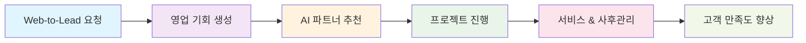
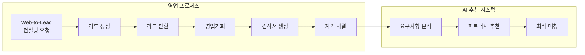
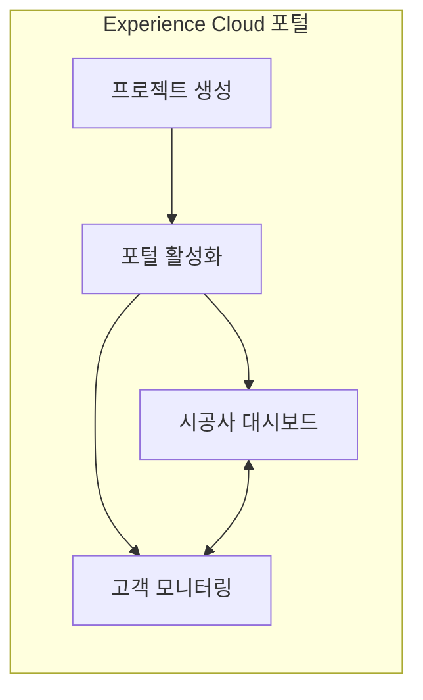
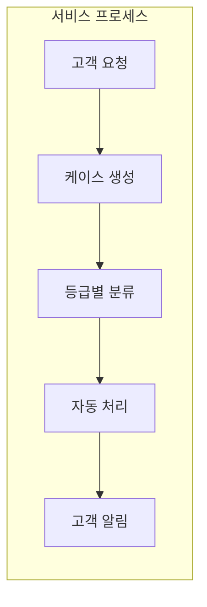

# 🏨 호텔 B2B 프로젝트 관리 시스템

> **모든 기능의 핵심은 하나입니다. 시스템으로 '불확실성을 확실성으로 바꾸기'**  
> 제각각이던 기준을 통일하고 주먹구구식 운영을 시스템화하고, 버려지던 데이터를 자산으로 관리

**Yashija B2B 혁신 프로젝트**는 기존의 분산된 비즈니스 프로세스를 통합하고, 고객 중심의 360도 서비스를 제공하는 혁신적인 B2B 플랫폼입니다.

| 🎯 핵심 가치 | 📈 주요 성과 |
|:---:|:---:|
| **영업 파이프라인 관리** | Web-to-Lead부터 Closed Won까지 체계적 관리 |
| **AI 기반 파트너 추천** | 의사결정 시간 **1일 → 10분** 단축 |
| **데이터 기반 의사결정** | 실시간 대시보드로 현황 파악 |

## 💡 개발 철학: 거인의 어깨 위에서 10%의 특수성만 해결

<table>
<tr>
<td width="50%">

### 🔑 핵심 가치
- **Low Code/Vibe Coding**  
  Low Code + Custom Code로 빠르고 효율적인 개발
- **고객 중심 혁신**  
  360도 고객 뷰를 통한 완전한 서비스 경험

</td>
<td width="50%">

### 🎯 실천 원칙
1. **클라이언트의 진짜 의도 파악하기**
2. **가장 효율적인 방법 선택하기**
3. **빠르게, 저렴하게, 정확하게 구현하기**

</td>
</tr>
</table>

## 🔧 Low Code/Vibe Coding의 진짜 의미

> Salesforce라는 거대한 플랫폼을 지렛대 삼아, 최소한의 코드로 최대한의 비즈니스 가치를 창출하는 것.  
> 이미 검증된 CRM 위에 고객의 특수성만 얹어 완성도 높은 솔루션을 빠르게 제공합니다.

## 🌟 Salesforce CRM과의 만남

대학 시절 품었던 **"기술로 어떻게 돈을 벌까?"**라는 의문이 Salesforce를 만나며 해결되었습니다.  
단순한 기능 구현이 아닌, **비즈니스 프로세스와 ROI를 중심으로 한 개발**. 이것이 제가 찾던 진짜 개발자의 길이었습니다.

🔹 **CRM 프로세스 설계** 🔹 **비즈니스 요구사항 분석** 🔹 **ROI 중심 솔루션 설계**

## 🎨 비즈니스 프로세스 흐름

### 📊 전체 프로세스 개요

### 1️⃣ 영업 및 계약 (Sales Cloud)

### 2️⃣ 프로젝트 관리 (Experience Cloud)

### 3️⃣ 서비스 관리 (Service Cloud)

## 🚀 주요 기능

### 📊 영업 KPI 기회 대시보드

<table>
<tr>
<td width="50%">

#### ❌ AS-IS (문제 상황)
- **혼재된 기준**: "협상은 언제부터인가요?"
- **모호한 현황**: 목표의 무게감을 체감할 수 없음
- **수동 계산**: Excel로 일일 30분 이상 소요

</td>
<td width="50%">

#### ✅ TO-BE (해결책)
- **통일된 기준**: 시스템이 정의하는 명확한 단계
- **실시간 현황**: 한눈에 보이는 목표 달성률
- **자동화**: 단계별 전환율 자동 계산

</td>
</tr>
</table>

**🎯 솔루션**: 모바일 최적화 LWC 대시보드 구현

- 📱 **실시간 목표 달성률** 표시
- 📈 **단계별 전환율** 자동 계산  
- 🌐 **외근 중에도 확인** 가능한 반응형 UI

**📊 주요 성과**
> 💼 **결과뿐 아니라 과정 지표 추가**  
> 🎯 영업 직원이 '얼마나 더 뛰어야 하는지' 정확히 파악  
> 🔄 지속가능한 영업 활동 지원

---

### 🤖 AI 기반 파트너 추천 시스템

**"개인의 역량과 경험에 의존하던 아날로그 방식"**  
⬇️  
**"데이터를 기반으로 AI와 협업하는 지능형 워크플레이스"**

#### 🔍 현실적인 문제 인식

<table>
<tr>
<td width="33%">

**👨‍💼 시니어 매니저**  
*"내 경험상 A사가 좋아"*

</td>
<td width="33%">

**👨‍💻 신입 사원**  
*"어... 왜 A사인지 모르겠는데 네, 알겠습니다"*

</td>
<td width="33%">

**📅 3개월 후**  
*"A사가 왜 안 맞았는지 이제 알겠네요"*

</td>
</tr>
</table>

#### 💡 진짜 니즈 파악

- ❌ **원하는 것**: 복잡한 AI 알고리즘
- ✅ **필요한 것**: **누구나 좋은 결정을 내릴 수 있는 시스템**

#### 🛠 솔루션: "경험을 데이터로, 직관을 로직으로"

**🔧 핵심 기능**
1. **요구사항 자동 분석**: 텍스트에 맞는 필요 역량 자동 도출
2. **인사이트 도출 시스템**: 창의성과 아이디어 인사이트 확보

**📈 정량적 성과**

| 지표 | Before | After | 개선율 |
|:---:|:---:|:---:|:---:|
| **의사결정 시간** | 1일 | 10분 | **99% ⬇️** |
| **신입 사원 적응** | 3개월 | 1주 | **92% ⬇️** |
| **노하우 보존** | 개인 의존 | 시스템 보존 | **100% ⬆️** |

#### 🏆 숨은 성과

> **"이제 퇴사해도 노하우는 남습니다"**
> 
> - 10개의 프로젝트 기록 = 10번의 학습
> - 시니어의 은퇴 ≠ 경험의 소멸  
> - 조직의 집단 지성 구축

*"AI는 우리를 대체하는 게 아니라, 우리 모두를 더 똑똑하게 만듭니다.  
이게 제가 생각하는 진짜 디지털 혁신입니다."*

---

### 📋 데이터 기반 시공사 추천

**"경험과 인맥에 의존 → 데이터 기반 최적 매칭"**

#### 🎯 효율성 중심의 접근

<table>
<tr>
<td width="50%">

**❓ 영업팀 요청**  
*"AI 추천 시스템이 필요해요"*

**🤔 진짜 니즈**  
- ❌ 복잡한 AI  
- ✅ **빠른 의사결정 지원**

</td>
<td width="50%">

**⚙️ 간단한 해결책**  
가중치 기반 추천 로직
- 전문분야(경력) `+20점`
- 파트너 평점 `평점 × 10`  
- 디자인 스타일 매칭 `+30점`

</td>
</tr>
</table>

**📊 프로젝트 성과**

| 지표 | 개선 결과 |
|:---:|:---:|
| 🕐 **개발 기간** | 2주 → **3일** |
| 💰 **비용** | **80% 절감** |
| 😊 **사용자 만족도** | **동일 수준 유지** |

---

### 🌐 Web-to-Lead 시스템

**고객이 걱정반 기대반인 감정으로 첫 우리 회사를 맞이하는 화면**

🎨 **고객 경험 최적화** 🎨

**Before** ➜ **After** 결과물을 통한 심리적 기대 향상

**🔧 주요 기능**
- 📱 직관적인 사용자 인터페이스
- ⚡ 실시간 리드 생성 및 관리  
- 💝 고객 경험 최적화

## 🛠 Service Cloud 자동화

### 🔄 고객 알림 + 내부 프로세스 자동화

#### ⚠️ 기존 문제점

> **"고객 클레임 발생!"**

<table>
<tr>
<td width="50%">

**👨‍💼 현장의 혼란**
- 영업사원: "부장님 승인 필요해요"
- 부장 A: "중요한 고객이니 바로 처리"  
- 부장 B: "일단 내일 확인하고"

**➜ 기준도, 프로세스도 제각각**

</td>
<td width="50%">

**😰 반복되는 실수**
- "고객한테 처리 완료 연락 깜빡했네"
- "승인은 받았는데 반료 사유 전달 안 했네"

**➜ 단순 작업 누락이 신뢰도를 깎아먹음**

</td>
</tr>
</table>

#### ✅ System - 자동화의 힘

| 🎯 개선 영역 | 🔧 해결 방법 | 📈 효과 |
|:---:|:---:|:---:|
| **등급별 분류** | 골드 고객 = 2시간 내 대응 | 명확한 기준 |
| **프로세스 표준화** | 접수→승인→처리→통보 자동 진행 | 누락 방지 |
| **자동 알림** | 각 단계마다 고객 상태 업데이트 | 신뢰도 향상 |

#### 🏆 확실한 변화

> **'말로만 2시간'에서 '시스템이 보장하는 2시간'으로**  
> 더 이상 깜빡할 일도, 기준이 달라질 일도 없습니다.

**🔧 주요 기능**
- 📧 고객 요청사항 접수 시 자동 이메일 확인
- ✅ 최종 승인 프로세스 자동화
- 🏅 SLA 기본 설정 (골드, 실버 + milestone)

---

### ⚡ Flow 자동화 기능

#### 🔔 Opportunity 후속조치 자동화

<table>
<tr>
<td width="50%">

**❌ 문제점**  
영업사원이 7일 동안 연락하지 않으면 기회 손실

</td>
<td width="50%">

**✅ 해결책**  
매일 아침 자동 Task 생성으로 리마인드

</td>
</tr>
</table>

**🎯 효과**: 직원이 놓칠 수 있는 기회를 상기시켜 고객과의 관계 유지

#### 📞 고객 요청사항 자동 처리

<table>
<tr>
<td width="50%">

**❌ 기존 방식**  
고객 전화 → 수동 처리 → 별도 승인 과정

</td>
<td width="50%">

**✅ 개선 방식**  
자동 프로세스 → 부장 승인까지 원클릭

</td>
</tr>
</table>

**🎯 효과**: 별도 연락이나 컨펌 받는 시간 대폭 단축

## 🛠 기술 스택

### 🔧 Salesforce Ecosystem

### 💻 개발 기술

  

### 🔄 자동화 도구

### 🛠 개발 환경

## 📊 프로젝트 성과 요약

| 🎯 주요 지표 | 📈 개선 결과 | 💡 핵심 가치 |
|:---:|:---:|:---:|
| **의사결정 시간** | 1일 → 10분 | 효율성 극대화 |
| **개발 기간** | 2주 → 3일 | 비용 효율성 |
| **프로세스 표준화** | 수동 → 자동 | 일관성 확보 |
| **고객 응대** | 말로만 → 시스템 보장 | 신뢰도 향상 |

## 🌟 핵심 철학

> **"기술로 어떻게 돈을 벌까?"**라는 대학 시절 의문이  
> Salesforce를 만나며 해결되었습니다.
> 
> 단순한 기능 구현이 아닌,  
> **비즈니스 프로세스와 ROI를 중심으로 한 개발**.  
> 이것이 제가 찾던 진짜 개발자의 길이었습니다.

## 📞 연락처

## 📖 참고 문서

  

---

🚀 **이 프로젝트는 Salesforce 청년 CRM 101 과정을 통해 개발되었습니다.**

🙌 **좋아요(⭐)와 Fork를 눌러주시면 큰 힘이 됩니다!**

