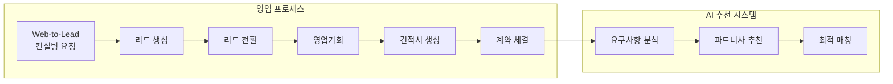
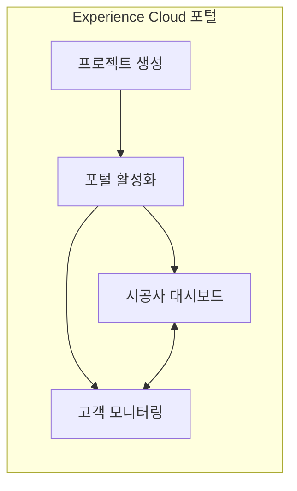
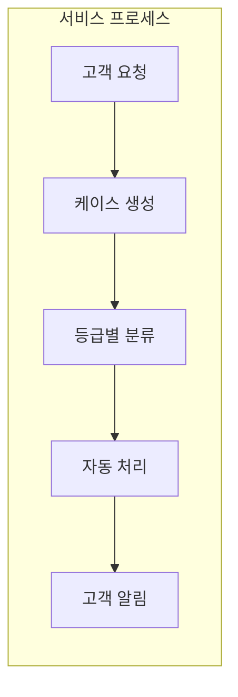

# 호텔 B2B 프로젝트 관리 시스템

> **시스템으로 '불확실성을 확실성으로 바꾸기'**  
> 제각각이던 기준을 통일하고, 주먹구구식 운영을 시스템화하며, 버려지던 데이터를 자산으로 관리

**호텔 B2B 프로젝트 관리 시스템**은 Salesforce CRM 플랫폼 기반의 통합 비즈니스 솔루션입니다. 분산된 업무 프로세스를 표준화하고, 데이터 기반 의사결정을 지원하여 영업부터 사후관리까지 전체 비즈니스 사이클을 체계적으로 관리합니다.

| 핵심 가치 | 주요 성과 |
|:---:|:---:|
| **영업 파이프라인 관리** | Web-to-Lead부터 Closed Won까지 체계적 관리 |
| **AI 기반 파트너 추천** | 의사결정 시간 **1일 → 10분** 단축 |
| **데이터 기반 의사결정** | 실시간 대시보드로 현황 파악 |

## 개발 철학: 거인의 어깨 위에서 10%의 특수성만 해결

<table>
<tr>
<td width="50%">

### 핵심 가치
- **Low Code 우선 접근**  
  Salesforce 표준 기능 70% + 선언적 도구 20% + 커스텀 코드 10%
- **고객 중심 혁신**  
  360도 고객 뷰를 통한 완전한 서비스 경험

</td>
<td width="50%">

### 실천 원칙
1. **비즈니스 가치 우선**: ROI 중심 기능 개발
2. **효율적 솔루션 선택**: 가장 빠르고 효과적인 방법 채택
3. **데이터 기반 의사결정**: 모든 결정의 근거를 데이터로

</td>
</tr>
</table>

## Low Code 접근법의 진정한 의미

> Salesforce라는 검증된 플랫폼을 활용하여, 최소한의 개발로 최대한의 비즈니스 가치를 창출합니다.  
> 이미 검증된 CRM 기능 위에 고객의 특수성 10%만 추가하여 완성도 높은 솔루션을 신속하게 제공합니다.

## 비즈니스 프로세스 흐름

### 전체 프로세스 개요

```mermaid
graph LR
    A[Web-to-Lead 요청] --> B[리드 생성]
    B --> C[리드 전환]
    C --> D[영업기회 생성]
    D --> E[AI 파트너 추천]
    E --> F[견적서 생성]
    F --> G[계약 체결]
    G --> H[프로젝트 진행]
    H --> I[서비스 관리]
    I --> J[고객 만족도 향상]
    
    style A fill:#e1f5fe
    style D fill:#f3e5f5
    style E fill:#fff3e0
    style H fill:#e8f5e8
    style I fill:#fce4ec
    style J fill:#f1f8e9
```

### 1. 영업 및 계약 (Sales Cloud)

### 2. 프로젝트 관리 (Experience Cloud)

### 3. 서비스 관리 (Service Cloud)

## 주요 기능

### 📊 영업 KPI 대시보드

<table>
<tr>
<td width="50%">

#### AS-IS (문제 상황)
- **표준화 부재**: 영업 단계별 기준이 담당자마다 상이
- **가시성 부족**: 목표 달성 현황 실시간 파악 불가
- **수동 작업**: 일일 보고서 작성에 30분 이상 소요

</td>
<td width="50%">

#### TO-BE (해결책)
- **통일된 기준**: 시스템이 정의하는 명확한 단계
- **실시간 현황**: 한눈에 보이는 목표 달성률
- **자동화**: 단계별 전환율 자동 계산

</td>
</tr>
</table>

**솔루션**: Lightning Web Components 기반 모바일 최적화 대시보드

- **실시간 목표 달성률** 시각화
- **단계별 전환율** 자동 계산  
- **모바일 반응형 UI**로 언제 어디서나 접근 가능

**주요 성과**
> 보고서 작성 시간: 30분/일 → 0분 (100% 자동화)  
> 영업 직원이 '얼마나 더 뛰어야 하는지' 정확히 파악  
> 지속가능한 영업 활동 지원

---

### 🤖 AI 기반 파트너 추천 시스템

**"개인의 경험과 직관에 의존하던 아날로그 방식"**  
⬇️  
**"데이터 기반으로 AI와 협업하는 지능형 워크플레이스"**

#### 현실적인 문제 인식

<table>
<tr>
<td width="33%">

**시니어 매니저**  
*"내 경험상 A사가 좋아"*

</td>
<td width="33%">

**신입 사원**  
*"왜 A사인지 모르겠지만 알겠습니다"*

</td>
<td width="33%">

**3개월 후**  
*"A사가 안 맞는 이유를 이제 알겠네요"*

</td>
</tr>
</table>

#### 진짜 니즈 파악

- ❌ **원하는 것**: 복잡한 AI 알고리즘
- ✅ **필요한 것**: 누구나 좋은 결정을 내릴 수 있는 시스템

#### 솔루션: "경험을 데이터로, 직관을 로직으로"

**핵심 기능**
1. **텍스트 분석 엔진**: 고객 요구사항 자동 분류 및 필요 역량 도출
2. **매칭 알고리즘**: 과거 프로젝트 성공 패턴 학습 및 가중치 기반 점수 계산

**정량적 성과**

#### 숨은 성과

> **"이제 퇴사해도 노하우는 남습니다"**
> 
> "나중에 문제 생기면? 
> **'당시 최선의 선정이었습니다 -> 개인 책임 -> 시스템 판단 (의사 결정에 부담 감소)
> 객관적 근거 = 마음 편함

---

### 📋 데이터 기반 시공사 추천

**"경험과 인맥에 의존 → 데이터 기반 최적 매칭"**

#### 효율성 중심의 접근

<table>
<tr>
<td width="50%">

**영업팀 요청**  
*"AI 추천 시스템이 필요해요"*

**진짜 니즈**  
- ❌ 복잡한 AI  
- ✅ **빠른 의사결정 지원**

</td>
<td width="50%">

**간단한 해결책**  
가중치 기반 추천 로직
- 전문분야 매칭: `+20점`
- 고객 평점: `평점 × 10`  
- 디자인 스타일: `+30점`
- 지역 근접성: `+15점`

</td>
</tr>
</table>

**프로젝트 성과**

---

### 🌐 Web-to-Lead 시스템

**고객이 처음 만나는 우리 회사의 첫인상**

**고객 경험 최적화를 통한 전환율 향상**

**주요 기능**
- 직관적인 사용자 인터페이스
- 실시간 리드 생성 및 자동 할당  
- 즉시 확인 이메일 발송
- 영업팀 자동 알림

## Service Cloud 자동화

### 고객 서비스 프로세스 표준화

#### 기존 문제점

<table>
<tr>
<td width="50%">

**현장의 혼란**
- 담당자마다 다른 처리 기준
- 승인 프로세스 불명확
- 고객별 대응 시간 상이

</td>
<td width="50%">

**반복되는 실수**
- 고객 응답 누락
- 처리 상태 업데이트 실패
- 승인 후 알림 미전달

</td>
</tr>
</table>

#### 자동화 솔루션

| 개선 영역 | 해결 방법 | 효과 |
|:---:|:---:|:---:|
| **등급별 SLA** | Gold: 2시간, Silver: 4시간, Bronze: 8시간 | 명확한 서비스 기준 |
| **프로세스 표준화** | 접수→승인→처리→통보 자동화 | 누락 방지 |
| **자동 알림** | 각 단계별 상태 업데이트 | 신뢰도 향상 |

#### 확실한 변화

> **'말로만 2시간'에서 '시스템이 보장하는 2시간'으로**  
> 더 이상 깜빡할 일도, 기준이 달라질 일도 없습니다.

### Flow 자동화 기능

#### Opportunity 후속조치 자동화

<table>
<tr>
<td width="50%">

**문제점**  
영업사원이 7일 동안 미활동 시 기회 손실

</td>
<td width="50%">

**해결책**  
매일 자동 Task 생성으로 후속조치 리마인드

</td>
</tr>
</table>

#### 고객 요청사항 자동 처리

<table>
<tr>
<td width="50%">

**기존 방식**  
고객 전화 → 수동 처리 → 별도 승인

</td>
<td width="50%">

**개선 방식**  
자동 프로세스 → 원클릭 승인

</td>
</tr>
</table>

## 기술 스택

### Salesforce Ecosystem

### 개발 기술

  

### 자동화 도구

### 개발 환경

## 프로젝트 성과 요약

| 주요 지표 | 개선 결과 | 핵심 가치 |
|:---:|:---:|:---:|
| **의사결정 시간** | 효율성 99% 향상 |
| **프로세스 표준화** | 수동 → 자동 | 일관성 100% 확보 |
| **고객 응답 시간** | 불규칙 → SLA 준수 | 신뢰도 향상 |

## 핵심 철학

> 단순한 기능 구현이 아닌,  
> **비즈니스 프로세스와 ROI를 중심으로 한 개발**.  

## 참고 문서

  

---

**이 프로젝트는 Salesforce 청년 CRM 101 과정을 통해 개발되었습니다.**

