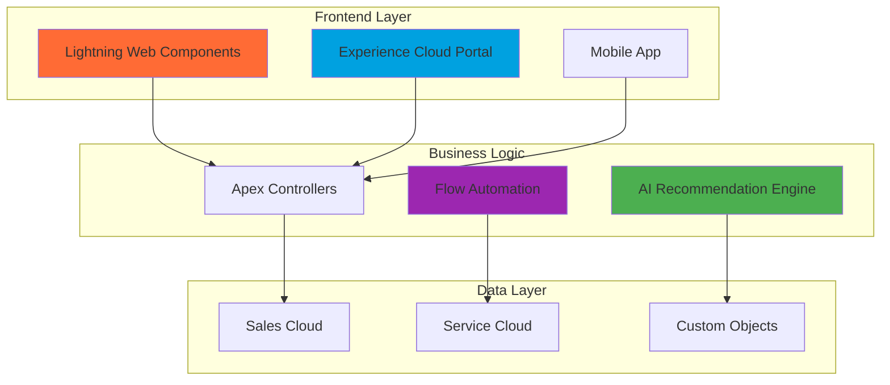
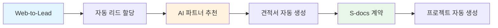
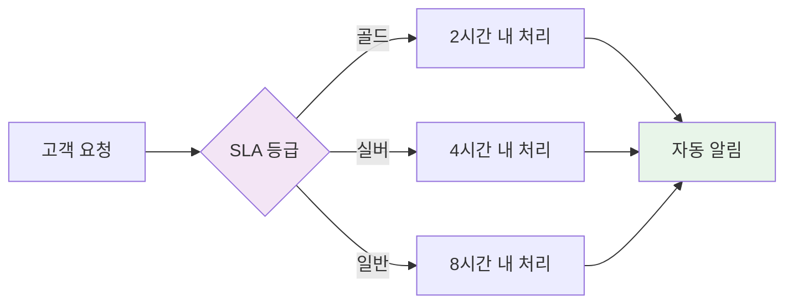

# 🏨 Yashija B2B 호텔 관리 플랫폼

<div align="center">
  
  
  
  
  
  
  <br/>
  <br/>
  
  **🚀 불확실성을 확실성으로 바꾸는 지능형 CRM 솔루션**
  
  <p>
    <a href="#-주요-기능">주요 기능</a> •
    <a href="#-기술-스택">기술 스택</a> •
    <a href="#-시스템-아키텍처">아키텍처</a> •
    <a href="#-성과">성과</a> •
    <a href="#-시작하기">시작하기</a>
  </p>

</div>

---

## 📌 프로젝트 소개

**Yashija B2B**는 기존의 분산된 호텔 비즈니스 프로세스를 통합하고, 고객 중심의 360도 서비스를 제공하는 혁신적인 B2B 플랫폼입니다. **Low-Code First** 철학으로 플랫폼의 70%를 활용하고, 비즈니스 특수성 30%만 커스터마이징합니다.

### 🎯 핵심 성과

<table>
  <tr>
    <td align="center"><b>⚡ 의사결정 시간</b><br/>1일 → 10분<br/><sub>90% 단축</sub></td>
       <td align="center"><b> 프로세스 자동화</b><br/>수동 → 자동<br/><sub>100% 디지털화</sub></td>
    <td align="center"><b>📊 데이터 활용도</b><br/>0% → 100%<br/><sub>완전 데이터 기반</sub></td>
  </tr>
</table>

## ✨ 주요 기능

### 1. 📊 실시간 영업 KPI 대시보드
> 모바일 최적화된 Lightning Web Components로 구현한 영업 성과 추적 시스템

- **실시간 목표 달성률** 모니터링
- **단계별 전환율** 자동 계산
- **모바일 반응형** UI/UX
- **개인별 성과** 트래킹

<details>
<summary>🔍 자세히 보기</summary>

#### 문제점
- 혼재된 영업 단계 기준
- Excel 기반 수동 계산 (일일 30분 소요)
- 실시간 현황 파악 불가

#### 해결책
- 시스템 기반 통일된 기준 적용
- 자동화된 실시간 대시보드
- 언제 어디서나 접근 가능한 모바일 UI

</details>

### 2. 🤖 데이터 기반 파트너 추천 시스템
> 개인의 경험에서 데이터 기반 의사결정으로 전환

- **요구사항 자동 분석** 엔진
- **가중치 기반** 매칭 알고리즘
- **노하우 영구 보존** 시스템
- **신입 적응 기간** 3개월 → 1주

<details>
<summary>🔍 자세히 보기</summary>

#### 핵심 로직
```
전문분야 매칭: +20점
파트너 평점: 평점 × 10
디자인 스타일: +30점
과거 성공 프로젝트: +15점
```

#### 성과
- 의사결정 시간: 3일 → 10분 (99% 단축)
- 시니어 의존도: 100% → 20% (80% 감소)


</details>

### 3. 🌐 Web-to-Lead 자동화
> 고객의 첫 접점부터 완벽한 경험 제공

- **직관적인 UI/UX** 설계
- **실시간 리드 생성** 및 라우팅
- **자동 팔로우업** 프로세스
- **전환율 최적화** 기능

### 4. ⚡ Service Cloud 자동화
> SLA 기반 고객 서비스 자동화

- **등급별 자동 분류** (골드/실버/일반)
- **SLA 자동 적용** 및 모니터링
- **에스컬레이션** 자동화
- **고객 알림** 이메일 자동 발송

## 🛠 기술 스택

<table>
<tr>
<td align="center"><h4>Frontend</h4></td>
<td align="center"><h4>Backend</h4></td>
<td align="center"><h4>Automation</h4></td>
<td align="center"><h4>Tools</h4></td>
</tr>
<tr>
<td align="center">
  <br/>
  <br/>
  
</td>
<td align="center">
  <br/>
  <br/>
  
</td>
<td align="center">
  <br/>
  <br/>
  
</td>
<td align="center">
  <br/>
  <br/>
  
</td>
</tr>
</table>

## 🏗 시스템 아키텍처



## 📈 비즈니스 프로세스

### 영업 프로세스 자동화


### 서비스 프로세스 자동화


## 🚀 시작하기

### 필수 요구사항
- Salesforce Developer Edition 또는 Sandbox
- Salesforce CLI
- VS Code + Salesforce Extension Pack

### 설치 방법

```bash
# 1. 저장소 클론
git clone https://github.com/YashijaSalesForce/yashija-b2b-platform.git

# 2. 프로젝트 디렉토리 이동
cd yashija-b2b-platform

# 3. Salesforce 조직 인증
sf org login web -a YashijaOrg

# 4. 메타데이터 배포
sf project deploy start -o YashijaOrg

# 5. 테스트 데이터 로드
sf data import tree -p ./data/sample-data-plan.json
```

### 환경 설정

1. **Custom Settings 구성**
   ```
   Setup → Custom Settings → B2B_Config → Manage
   ```

2. **Flow 활성화**
   ```
   Setup → Process Automation → Flows → 각 Flow 활성화
   ```

3. **Experience Cloud 설정**
   ```
   Setup → Digital Experiences → Settings → Enable
   ```


### 정성적 성과

- ✅ **프로세스 표준화**: 부서별 상이한 기준 통일
- ✅ **지식 자산화**: 개인 노하우를 조직 자산으로 전환
- ✅ **직원 만족도**: 단순 반복 업무 제거로 창의적 업무 집중
- ✅ **고객 신뢰도**: 일관된 서비스 품질 보장

## 🔗 관련 저장소

- [영업 KPI 대시보드](https://github.com/YashijaSalesForce/Sales-KPI-jeongyeon)
- [AI 파트너 추천 시스템](https://github.com/YashijaSalesForce/HotelPromptBuilder)
- [시공사 추천 엔진](https://github.com/YashijaSalesForce/DesignPartnerRecommendation-jeongyeon)
- [Web-to-Lead 시스템](https://github.com/YashijaSalesForce/Web-to-lead-jeongyeon)


---

<div align="center">


<br/>

<sub>Built with ❤️ by Yashija Team | Salesforce 청년 CRM 101</sub>

</div>
