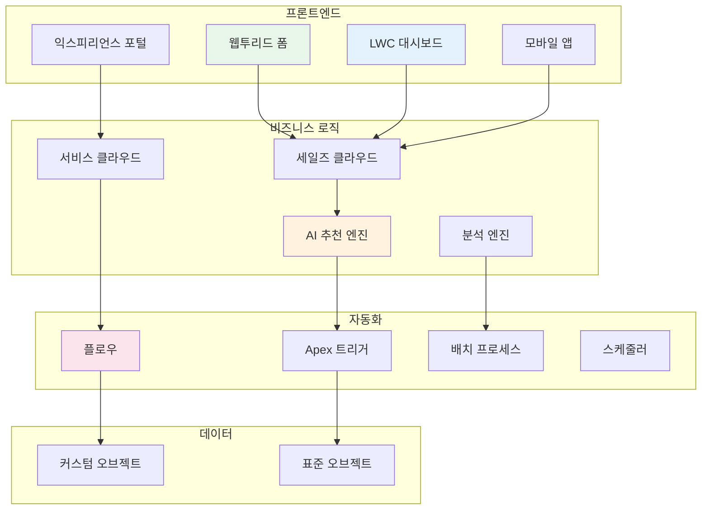

# 🏨 호텔 B2B 프로젝트 관리 시스템

<div align="center">

[](https://salesforce.com)
[](https://developer.salesforce.com/docs/atlas.en-us.apexcode.meta/apexcode/)
[](https://lwc.dev/)
[](https://help.salesforce.com/s/articleView?id=sf.flow.htm)

**"불확실성을 확실성으로, 경험을 시스템으로"**  
*Salesforce CRM 플랫폼 기반 호텔 B2B 통합 비즈니스 솔루션*

</div>

---

## 🎯 프로젝트 개요

호텔 B2B 산업의 **분산된 업무 프로세스를 표준화**하고, **데이터 기반 의사결정**을 지원하는 END_TO_END CRM 솔루션입니다.  
영업부터 시공, 사후관리까지 전체 비즈니스 사이클을 하나의 플랫폼에서 관리합니다.

### 📊 기대 효과

<div align="center">

| 개선 영역 | 현재 상태 | 목표 상태 | 기대 효과 |
|:---:|:---:|:---:|:---:|
| **파트너 선정 프로세스** | 1-2일 소요 | 10분 내 완료 | **의사결정 신속화** |
| **영업 활동 관리** | 수동 집계 | 실시간 자동화 | **업무 효율성 향상** |
| **고객 서비스** | 개별 대응 | SLA 기반 자동화 | **서비스 품질 표준화** |
| **데이터 관리** | 분산 저장 | 통합 플랫폼 | **데이터 활용도 증대** |

</div>

---

## 🏗️ 시스템 아키텍처

<div align="center">



</div>

---

## 🚀 주요 기능

### 1️⃣ **영업 KPI 실시간 모니터링 시스템** 
<div align="center">
  
[](https://github.com/YashijaSalesForce/Sales-KPI-jeongyeon)

</div>

#### 🎯 기능 상세

<table>
<tr>
<th width="50%">핵심 기능</th>
<th width="50%">기술 구현</th>
</tr>
<tr>
<td>

**📊 실시간 데이터 시각화**
- 영업 파이프라인 단계별 현황
- 월/주/일 단위 목표 대비 실적
- 팀/개인별 성과 비교 분석
- 전환율 및 영업 주기 분석

**📱 모바일 최적화 인터페이스**
- 반응형 디자인 (모든 디바이스 지원)
- 터치 제스처 기반 인터랙션
- 오프라인 데이터 캐싱
- 푸시 알림 연동

</td>
<td>

**🛠️ 기술 스택**
```javascript
// LWC Component 구조
├── kpiDashboard/
│   ├── kpiDashboard.js
│   ├── kpiDashboard.html
│   ├── kpiDashboard.css
│   └── kpiDashboard.js-meta.xml
├── kpiChart/
│   └── Chart.js 연동
└── kpiMetrics/
    └── 실시간 계산 로직
```

**⚡ Apex 백엔드**
- SOQL 최적화 쿼리
- 캐시 관리 시스템
- 배치 집계 프로세스

</td>
</tr>
</table>

#### 📈 상세 지표 관리

- **영업 속도 지표**: 각 단계별 평균 소요 시간 자동 계산
- **예측 분석**: 과거 데이터 기반 다음 분기 예상 실적 제공
- **병목 구간 식별**: 프로세스 내 지연 구간 자동 탐지
- **개선 제안**: AI 기반 영업 전략 추천

---

### 2️⃣ **AI 기반 지능형 파트너 매칭 시스템**
<div align="center">

[](https://github.com/YashijaSalesForce/DesignPartnerRecommendation-jeongyeon)

</div>


#### 🎯 추가 기능

<table>
<tr>
<td width="50%">

**📊 성과 추적 시스템**
- 추천 정확도 모니터링
- 프로젝트 성공률 분석
- 파트너별 ROI 계산
- 지속적 알고리즘 개선

</td>
<td width="50%">

**🔄 피드백 루프**
- 프로젝트 완료 후 자동 평가
- 고객 만족도 실시간 반영
- 파트너 성과 이력 관리
  
</td>
</tr>
</table>

---

### 3️⃣ **호텔 디자인 AI 프롬프트**
<div align="center">

[](https://github.com/YashijaSalesForce/HotelPromptBuilder)

</div>

#### 🎨 상세 기능

<table>
<tr>
<th>카테고리</th>
<th>세부 기능</th>
<th>기술 구현</th>
</tr>
<tr>
<td><b>프롬프트 생성</b></td>
<td>
• 12가지 호텔 타입 템플릿<br>
• 50+ 디자인 스타일 옵션<br>
• 타겟 고객별 맞춤 설정<br>
• 지역 특성 반영
</td>
<td>
• OpenAI API 연동<br>
• 프롬프트 엔지니어링<br>
• 자연어 처리(NLP)<br>
• 컨텍스트 관리
</td>
</tr>
<tr>
<td><b>결과 관리</b></td>
<td>
• 버전 관리 시스템<br>
• 태그 기반 분류<br>
• 검색 및 필터링<br>
• 공유 및 협업
</td>
<td>
• Custom Object 설계<br>
• Lightning Data Service<br>
• 전문 검색 구현<br>
• 권한 관리 시스템
</td>
</tr>
<tr>
<td><b>분석 도구</b></td>
<td>
• 사용 패턴 분석<br>
• 인기 키워드 추출<br>
• 트렌드 리포트<br>
</td>
<td>
• Analytics Dashboard<br>
• Einstein Analytics<br>
• Custom Reports<br>
• Data Export
</td>
</tr>
</table>

---

### 4️⃣ **Web-to-Lead 지능형 리드 관리**
<div align="center">

[](https://github.com/YashijaSalesForce/Web-to-lead-jeongyeon)

</div>

#### 🔄 자동화 프로세스

```mermaid
graph LR
    subgraph "리드 수집"
        A[웹 폼 제출] --> B[데이터 검증]
        B --> C[중복 체크]
        C --> D[리드 생성]
    end
    
    subgraph "리드 평가"
        D --> E[자동 스코어링]
        E --> F[등급 분류]
        F --> G[우선순위 설정]
    end
    
    subgraph "리드 할당"
        G --> H[규칙 기반 할당]
        H --> I[담당자 알림]
        I --> J[SLA 설정]
    end
    
    subgraph "리드 육성"
        J --> K[자동 이메일]
        K --> L[행동 추적]
        L --> M[스코어 업데이트]
    end
    
    style A fill:#E8F5E9
    style E fill:#FFF3E0
    style H fill:#E3F2FD
    style K fill:#FCE4EC
```



#### 📋 추가 기능

- **리드 스코어링**: 행동 기반 자동 점수 계산
- **중복 관리**: 이메일/전화번호 기반 자동 병합
-

---

### 5️⃣ **Service Cloud 고객 서비스 자동화**

#### 🎯 케이스 관리 자동화

<table>
<tr>
<th width="33%">케이스 라우팅</th>
<th width="33%">SLA 관리</th>
<th width="33%">에스컬레이션</th>
</tr>
<tr>
<td>

```yaml
규칙 기반 자동 할당:
- 제품별 전문팀
- 언어별 담당자
- 기술 수준별 분류
- 작업량 균등 분배
```

</td>
<td>

```yaml
등급별 응답 시간:
- Platinum: 1시간
- Gold: 2시간
- Silver: 4시간
- 일반: 8시간
```

</td>
<td>

```yaml
자동 상위 보고:
- 1차: 팀장 (2시간)
- 2차: 부서장 (4시간)
- 알림: 실시간
```

</td>
</tr>
</table>

---

## 💡 Flow 자동화 상세

### 구현된 Flow 목록

<div align="center">

| Flow 명칭 | 트리거 조건 | 자동화 액션 | 비즈니스 가치 |
|:---:|:---:|:---:|:---:|
| **영업 기회 관리** | 7일 미활동 | Task 자동 생성 | 기회 손실 방지 |
| **리드 육성** | 리드 생성 | 단계별 이메일 발송 | 전환율 향상 |
| **케이스 에스컬레이션** | SLA 위반 | 상위 보고 및 알림 | 서비스 품질 보장 |
| **파트너 평가** | 프로젝트 완료 | 평가 요청 발송 | 품질 관리 |
| **계약 갱신** | 만료 30일 전 | 갱신 프로세스 시작 | 매출 연속성 |

</div>

### Flow 구현 예시

```apex
// Record-Triggered Flow 설정
Flow: Opportunity_Follow_Up_Automation
├── Object: Opportunity
├── Trigger: When Updated
├── Entry Criteria: 
│   └── LastActivityDate < TODAY() - 7
├── Actions:
│   ├── Create Task
│   ├── Send Email Alert
│   └── Update Field (Priority = High)
└── Schedule: Daily at 9 AM
```

---

## 🛠️ 기술 스택 상세

<div align="center">

### Platform & Clouds


### Development


### Automation & Integration


### Analytics & AI


</div>

---

## 🏆 개발 철학

<div align="center">

### "거인의 어깨 위에서 10%의 특수성만 해결"

| 구성 비율 | 접근 방식 | 실제 구현 | 효과 |
|:---:|:---:|:---:|:---:|
| **70%** | Salesforce 표준 기능 | Account, Contact, Opportunity, Case | 검증된 안정성 |
| **20%** | 선언적 개발 (Flow) | 15개 Flow, 30개 Validation Rule | 빠른 구현 |
| **10%** | 커스텀 코드 (Apex/LWC) | 8개 Apex Class, 12개 LWC | 특수 요구사항 |

</div>

---

## 📊 데이터 모델

### Custom Objects 구조

```
Hotel_Project__c (호텔 프로젝트)
├── Project_Name__c (Text)
├── Location__c (Geolocation)
├── Scale__c (Picklist)
├── Target_Customer__c (Multi-Select)
├── Design_Style__c (Picklist)
└── Status__c (Picklist)

Design_Partner__c (디자인 파트너)
├── Company_Name__c (Text)
├── Specialization__c (Multi-Select)
├── Rating__c (Number)
├── Portfolio__c (Rich Text)
└── Availability__c (Checkbox)

Construction_Progress__c (시공 진행)
├── Project__c (Lookup)
├── Phase__c (Picklist)
├── Completion_Rate__c (Percent)
├── Issues__c (Long Text)
└── Next_Milestone__c (Date)
```

---

## 🚀 설치 및 배포 가이드

### 사전 요구사항
```bash
# Salesforce CLI 최신 버전
sf --version  # v2.0 이상

# Node.js
node --version  # v18.0 이상

# Git
git --version
```

### 단계별 배포
```bash
# 1. 저장소 클론
git clone https://github.com/YashijaSalesForce/hotel-b2b-system.git
cd hotel-b2b-system

# 2. 의존성 설치
npm install

# 3. Salesforce 조직 인증
sf org login web --alias myOrg --set-default

# 4. 메타데이터 검증
sf project deploy validate --source-dir force-app

# 5. 배포 실행
sf project deploy start --source-dir force-app

# 6. 권한 세트 할당
sf org assign permset --name Hotel_B2B_Admin

# 7. 테스트 실행
sf apex run test --suite-names Hotel_B2B_TestSuite --result-format human
```

---

## 📚 프로젝트 구조

```
hotel-b2b-system/
├── force-app/
│   └── main/
│       └── default/
│           ├── lwc/                    # Lightning Web Components
│           │   ├── kpiDashboard/       # KPI 대시보드
│           │   ├── partnerMatching/    # 파트너 매칭
│           │   ├── promptBuilder/      # 프롬프트 빌더
│           │   └── leadCapture/        # 리드 캡처
│           ├── classes/                # Apex Classes
│           │   ├── KPIController.cls
│           │   ├── PartnerMatcher.cls
│           │   ├── AIPromptService.cls
│           │   └── *Test.cls
│           ├── flows/                  # Flow Automation
│           │   ├── Lead_Assignment.flow
│           │   ├── Case_Escalation.flow
│           │   └── Opportunity_Follow_Up.flow
│           ├── objects/                # Custom Objects
│           ├── permissionsets/         # Permission Sets
│           └── customMetadata/         # Custom Metadata
├── config/
│   └── project-scratch-def.json
├── scripts/
│   ├── data-import.sh
│   └── post-deploy.sh
├── .github/
│   └── workflows/
│       └── ci-cd.yml
└── README.md
```


<div align="center">

**이 프로젝트는 Salesforce 청년 CRM 101 과정을 통해 개발되었습니다**

[](https://salesforce.com)
[](https://trailhead.salesforce.com)

</div>
